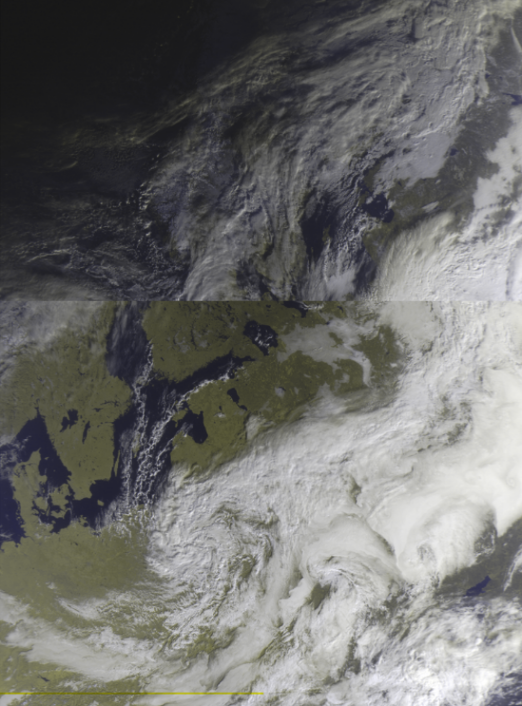
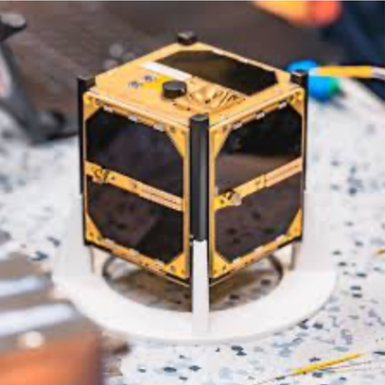
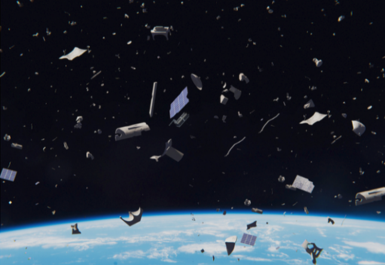
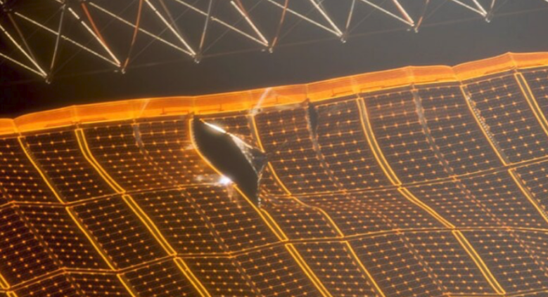
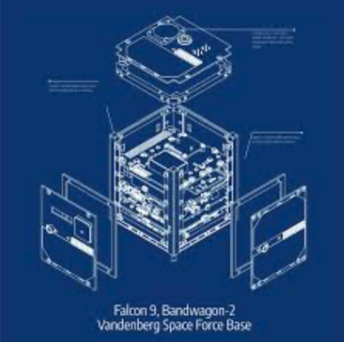

# Antény do škol – Manuál

## Úvod

Ahoj!
Máte před sebou manuál, v němž krok po kroku zjistíte, jak anténu používat a přijmout s ní první data. Snažili jsme se návod sepsat co nejstručněji, zároveň však tak, aby obsahoval vše podstatné. V případě dotazů se na nás můžete obrátit – kontaktní údaje najdete na zadní stránce manuálu.

Na začátek ale – o čem vlastně **Antény do škol** jsou?

Jedná se o projekt vytvořený středoškoláky z týmu **LASAR**, s cílem přiblížit vesmír studentům z České republiky a ukázat jim, jak moc je space na dosah.

---

## Co najdete v krabici?

V krabici vidíte dvě antény. Zaměříme se nejprve na větší z nich.

### Yagi-Uda anténa

Větší anténa se jmenuje **Yagi-Uda** (zkráceně Yagina), podle dvou japonských vynálezců, kteří ji před téměř 100 lety sestrojili.

Ačkoliv připomíná zbraň ze sci-fi filmu, žádné paprsky nestřílí. Místo toho dokáže velmi dobře přijímat elektromagnetické vlny i na velké vzdálenosti.

Pro porovnání:

* Mobilní telefon zachytí Wi-Fi přibližně na desítky metrů.
* V husté zástavbě nebo přes několik zdí je dosah ještě menší.

Yagina je ale natolik citlivá, že dokáže zachytit přenosy přicházející až z oběžné dráhy Země – tedy ze vzdálenosti stovek až tisíců kilometrů.

---

## Konstrukce Yagi antény

Půjdeme-li od přední části (tou budete mířit na oblohu), uvidíte:

### Direktory

Pět kratších tyček vpředu.
Fungují jako soustava čoček v dalekohledu – usměrňují a zaostřují elektromagnetické vlny směrem k dalšímu prvku.

### Zářič

Šestá tyčka v pořadí.
Jako jediná je připojena k počítači pomocí koaxiálního kabelu. Právě zde se indukuje elektrický proud, který počítač převádí na data.

### Reflektor

Sedmá tyčka, nejblíže držáku.
Funguje jako síť za brankářem – pokud vlna projde přes zářič, reflektor ji odrazí zpět, aby ji zářič mohl zachytit.

### Zesilovač

Nachází se v bílé krabičce mezi zářičem a reflektorem.
Zesiluje přijatý signál a čistí ho od parazitního šumu. Výsledkem je výrazně čistší spektrum, ze kterého lze získat více informací.

> obrázek waterfallu bez zesilovače a se zesilovačem (exaggerated)
> sem se dají všechny teorie ohledně co je to anténa a tak <

---

## Druhá anténa – Dipól

Druhá anténa je menší a konstrukčně jednodušší. Říká se jí **dipól**.

Nenechte se zmást – s touto anténou můžete přijímat satelitní snímky Země, podobné těm, které vídáte v televizi při předpovědi počasí.

Používají se například:

* pro meteorologii,
* v zemědělství,
* ke sledování změn krajiny.

> obrázek z METEORu (dodáme z engineeringu) <
> obrázek METEORu <

---

## Jak to celé funguje?

Možná si říkáte:

> Vždyť jsou to jen dvě tyčky. Jak z toho může vzniknout obrázek?

Analogicky:

* **Yagi** je jako přesný sniper – zachytí slabé přenosy z malých družic, ale musíte přesně mířit.
* **Dipól** je jako všímavá babička na balkoně – není tak citlivý, ale zachytí skoro všechno, co proletí kolem.

---

## Co vysílá data? Seznamte se: LASARsat

Seznamte se s družicí **LASARsat**.

I když je oproti velkým družicím (například GPS, které jsou velké jako menší auto) velmi malý – téměř se vejde do dlaně – má velký úkol.

Jeho primární úkol?
Doslova být terčem.

Ano, opravdu. Testujeme na něm laserové sledování a interakci s objekty na oběžné dráze.

### Proč?

Kvůli vesmírnému smetí.

Vesmírné smetí tvoří zbytky raket a nefunkčních družic. Ty mohou narážet do dalších objektů a vytvářet další úlomky. Proto se hledají metody, jak jej monitorovat a v budoucnu odstraňovat.

> obrázek vesmírného smetí <

> díra v solárním panelu ISS po zásahu úlomkem <

### Druhotný úkol

Když po něm zrovna nikdo nestřílí, vysílá vědecká data zpět na Zemi.

Na palubě má například dozimetry – senzory měřící ionizující záření v okolí.

> obrázek paluby LASARsatu <

> sem se dají všechny teorie vysílání a tak, k čemu je digitální rádio, co je koaxiální kabel atd. <

---

## Přijetí LASARsatu pomocí Yagi antény

### Příprava hardwaru

1. Vyjměte Yagi anténu z krabice.
2. Odstraňte polystyrenové ochrany.
3. Nesundávejte černé konce direktorů.
4. Vyjměte digitální rádio RTL-SDR.
5. Sundejte červenou ochrannou krytku.
6. Našroubujte koaxiální kabel z antény na mosazný konektor.

---

### Software – příprava (doporučeno předem, cca 30 min)

### Look4Sat (Android/iOS)

1. Nainstalujte aplikaci Look4Sat.
2. Klikněte na žluté tlačítko s fajfkou.
3. Do Search by Name/ID zadejte LASARSAT.
4. Vyberte nalezený satelit.
5. Opět klikněte na žlutou fajfku.
6. Vyberte nejbližší přelet.

Kompas reaguje na náklon telefonu – horní hrana ukazuje směr družice.

Doporučujeme více telefonů kvůli možné rozkalibraci kompasu.

---

### SatDump – Windows

1. Stáhněte verzi x64 portable.
2. Rozbalte archiv.
3. Spusťte aplikaci s ikonou antény.
4. Nahrajte potřebnou pipeline do složky `Pipelines`.

---

### Nastavení SatDumpu

### Recorder mód

* Device → vyberte RTL-SDR.
* Nastavte frekvenci: **436,925 MHz**
* LNA Gain → doporučeno 49.6
* AGC spíše nepoužívat
* Bias Tee → zapnout (aktivuje zesilovač)

Recording:

* Formát: `cf32`
* Start Recording (musí svítit zeleně)

---

### Příjem

1. Sledujte odpočet v Look4Sat.
2. V SatDumpu klikněte Start (Device i Recording).
3. Namiřte anténu podle mobilu.
4. Signál se objeví nad ~10° elevace.
5. Po přeletu klikněte Stop.

---

## Dekódování signálu

1. Otevřete SatDump.
2. Zvolte Offline Processing.
3. Vyhledejte pipeline **VERONICA**.
4. Vyberte Input file.
5. Zkontrolujte `cf32`.
6. Klikněte Start.

Další kroky doplnit.
`DEKÓDOVÁNÍ SIGNÁLU – JAK TO UMÍ HERGET`

---

## Přijetí METEOR pomocí dipólu

### Příprava dipólu

1. Připevněte na držák.
2. Vysuňte obě tyčky na 54 cm.
3. Rozevřete do 120° (doporučen úhloměr).
4. Připojte koaxiální kabel k RTL-SDR.

Neměňte délku ani úhel – ovlivňuje to kvalitu příjmu.

---

### Look4Sat

Vyhledejte satelity METEOR a sledujte přelet.

---

### Příjem v SatDumpu

Postup je obdobný jako u Yagi, pouze nastavíte správnou frekvenci METEOR satelitu.

---

### Viewer

Po zpracování dat:

* Složka `live_output`
* RGB composites → změna filtrů
* Map Overlay → hranice, města
* Apply pro potvrzení změn

Projection není nutné řešit.

---

### Settings

#### General

* Nastavit GPS souřadnice (QTH)

#### File Input/Output

* Nastavit výstupní složku (1. a 3. položka)

---

## Příprava na příjem

Ideální místo:

* vyvýšené,
* mimo zástavbu,
* bez železobetonových konstrukcí (Faradayova klec).

RTL-SDR zapojte do USB.

Doporučujeme nácvik před skutečným přeletem.

---

## Troubleshooting

Work in progress.